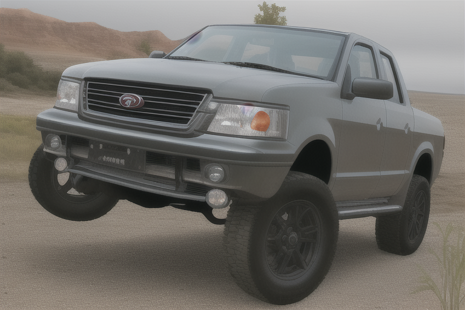
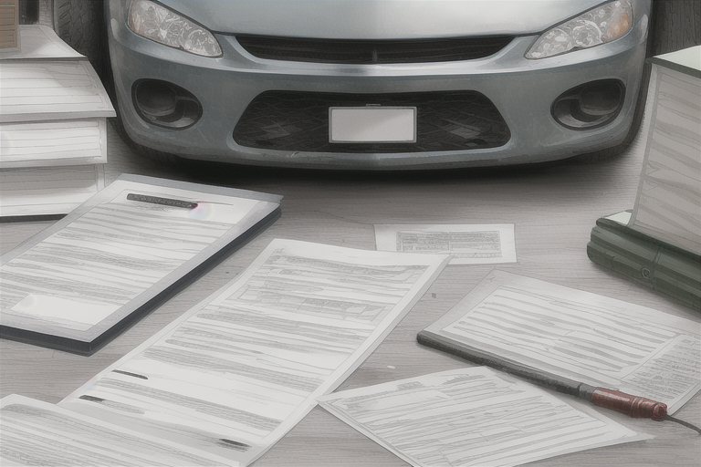

+++
draft = false
resources = []
title = "选购二手皮卡需要注意什么"
tags = [
  "皮卡推荐"
]
pubdate = "now"
+++

二手皮卡车在城市和乡村都有很大的市场。它们具有强大的牵引力和装载能力，因此非常适合运输大型货物。但是，购买一辆二手皮卡车需要注意一些事项。

如果你想要购买一辆二手皮卡，那么你需要注意以下几点。

### 1. 车况检查

首先，您需要仔细检查车辆的整体状况。这包括查看车身、底盘、发动机和传动系统等部分的磨损和损坏情况。您可以自己检查车辆，但最好找一个专业技师检查车辆以确保它的健康状况。车辆的状况决定了您在未来的维护成本，所以一定要谨慎。

### 2. 车辆历史

在购买二手皮卡之前，最好了解车辆的历史。这包括车辆的前任所有者、事故历史、保养记录、维修历史和任何其他有关车辆的重要信息。了解这些信息可以帮助您更好地评估车辆的整体状况。

### 3. 购买途径

您可以通过各种渠道购买二手皮卡车，例如经销商、私人销售和拍卖。每个渠道都有其优缺点。对于经销商销售的车辆，通常会有更多的保证和保修。私人销售的车辆通常会更便宜，但也需要更仔细地检查。拍卖可能是获得更好价格的好选择，但也需要更加小心，因为您无法检查车辆。

### 4. 购买成本

购买二手皮卡的成本取决于多个因素，包括车辆的年份、里程数、品牌和型号等。在决定购买哪辆车时，一定要将整个购买成本考虑在内，包括购买价、保险、税费、维护和修理等成本。

### 5. 保险

购买二手皮卡前，最好了解与车辆相关的保险成本。不同的车辆和保险公司可能会有不同的保险费用。在决定购买哪辆车时，一定要考虑这些成本。

在购买二手皮卡车之前，了解这些关键点可以帮助您做出明智的决策，并确保您购买到的车辆能够满足您的需求并且经济实惠。

最后，记得在购买之前进行充分的研究和比较，以确保您得到最好的交易。祝您好运！
